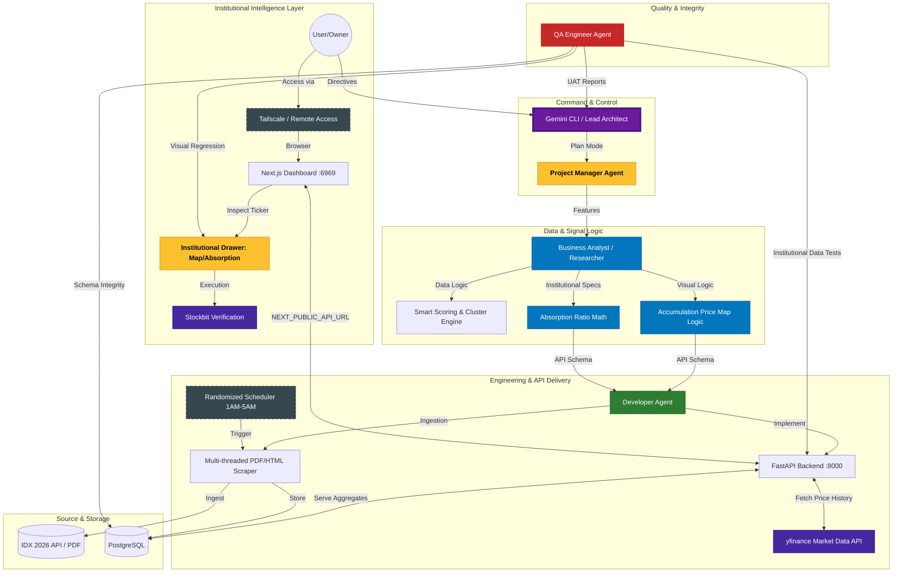

# 🇮🇩 IDX OpenInsider: Institutional Intelligence Engine

A real-time Indonesian insider trading intelligence platform that identifies high-conviction signals from Directors and Commissioners (Direksi/Komisaris) at the Indonesia Stock Exchange (IDX).


## 💎 Institutional Killer Features

### 1. Insider Accumulation Price Map
A Bloomberg-tier horizontal volume profile that plots exact price-volume clusters of insider transactions. Instantly identify the "Fundamental Floor" where the smartest money in Indonesia is accumulating shares relative to the current market price.

### 2. Supply Choke & Absorption Ratio
Calculates the **Absorption Ratio**: `(Total Insider Buys / 30-Day Average Daily Volume)`. Detects rare "Supply Choke" events where insiders absorb multiple days' worth of entire market liquidity, indicating massive conviction.

### 3. Cluster Buy Engine 🔥
Identifies high-conviction accumulation patterns where multiple unique insiders (e.g., three different Directors) buy the same ticker within a rolling window.

### 4. Stockbit "Trade" Integration
Direct deep-linking to Stockbit Insider pages for every transaction, enabling instant cross-verification and one-click trade execution.

## 🚀 Core Features

- **Real-Time Data Ingestion:** Automated scraping of IDX "Keterbukaan Informasi" using Playwright to bypass modern anti-bot protections.
- **Smart Scoring System:** Analyzes roles, transaction values, and patterns to assign 0-10+ Conviction Scores.
- **Financial Terminal UI:** Modern, dark-mode dashboard built with Next.js (16+), featuring real-time filtering and responsive design.
- **Network Agnostic:** Fully containerized with Docker for seamless access via Tailscale, Public IPs, or Private VPNs.

## 🛠 Tech Stack

- **Frontend:** Next.js 16 (TypeScript, Tailwind CSS, Recharts)
- **Backend:** FastAPI (Python 3.11), SQLAlchemy, yfinance (Liquidity Data)
- **Database:** PostgreSQL 15 (PostGIS-ready)
- **Scraper:** Playwright (Headless Chromium), pdfplumber, Tesseract OCR
- **Orchestration:** Docker Compose

## 📦 Quick Start

### 1. Prerequisites
- Docker & Docker Compose.
- Tailscale (recommended for remote access).

### 2. Launch
```bash
docker compose up -d
```
The dashboard will be available at `http://localhost:6969` (or your Server IP).

## 🧠 Agent Orchestration & Workflow

This system is built and maintained by a coordinated team of autonomous AI agents.



---
*“Siapa insider di Indonesia yang sedang membeli saham secara signifikan?” — Dashboard is LIVE and cross-checked.*
